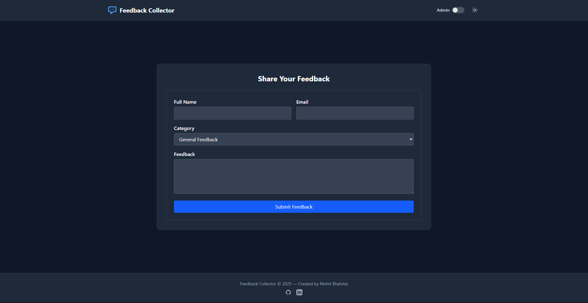

# 📝 Feedback Collector

Collect, manage, and analyze user feedback with a modern, themeable web app! 🚀

---

## 📖 Overview
Feedback Collector is a full-stack application designed to help you gather, review, and gain insights from user feedback. It features a beautiful, responsive interface with light and dark themes, an intuitive admin panel, and secure authentication.

---

## ✨ Features
- Collect feedback from users with a simple form
- Admin dashboard for reviewing, filtering, and managing feedback
- Dashboard statistics and analytics
- Light & dark theme toggle 🌗
- Secure admin authentication 🔐
- Responsive design for all devices
- Easy deployment (Vercel, Netlify, etc.)

---

## 🎬 Demo
<!-- Add screenshots or GIFs here -->


---

## 🛠️ Tech Stack
- **Frontend:** React, TailwindCSS, Vite
- **Backend:** Node.js, Express
- **Database:** MongoDB

---

## 🚀 Getting Started
### Prerequisites
- Node.js & npm
- MongoDB instance (local or Atlas)

### 1. Clone the repository
```bash
git clone https://github.com/yourusername/feedback-collector.git
cd feedback-collector
```

### 2. Setup Backend
```bash
cd Backend
npm install
```
Create a `.env` file in `Backend/`:
```env
MONGODB_URI=your_mongodb_connection_string
ADMIN_SECRET=your_admin_password
```
Start the backend:
```bash
npm start
```

### 3. Setup Frontend
```bash
cd ../Frontend
npm install
```
Create a `.env` file in `Frontend/`:
```env
VITE_API_URL=http://localhost:5000
```
Start the frontend:
```bash
npm run dev
```

---

## ⚙️ Environment Variables
| Variable         | Location   | Description                       |
|------------------|------------|-----------------------------------|
| MONGODB_URI      | Backend    | MongoDB connection string         |
| ADMIN_SECRET     | Backend    | Admin panel password              |
| VITE_API_URL     | Frontend   | Backend API base URL              |

---

## 📋 Usage
- Users submit feedback via the home page form.
- Admins log in to review, filter, and manage feedback.
- Use the theme toggle in the header to switch between light and dark modes.

---

## 🛡️ Admin Panel
- Enter the admin password (set in your backend `.env`).
- Admin Password : 12345678
- View, filter, and delete feedback entries securely.

---

## 🎨 Theming
- Toggle light/dark mode from the header.
- Theme preference is saved for future visits.
- All components are styled for both modes.

---

## ☁️ Deployment
- Deploy backend (Vercel)
- Deploy frontend (Netlify)
- Update environment variables for production URLs and secrets.


Feel free to connect on [LinkedIn](https://www.linkedin.com/in/mohit-bhalotia) 

---
